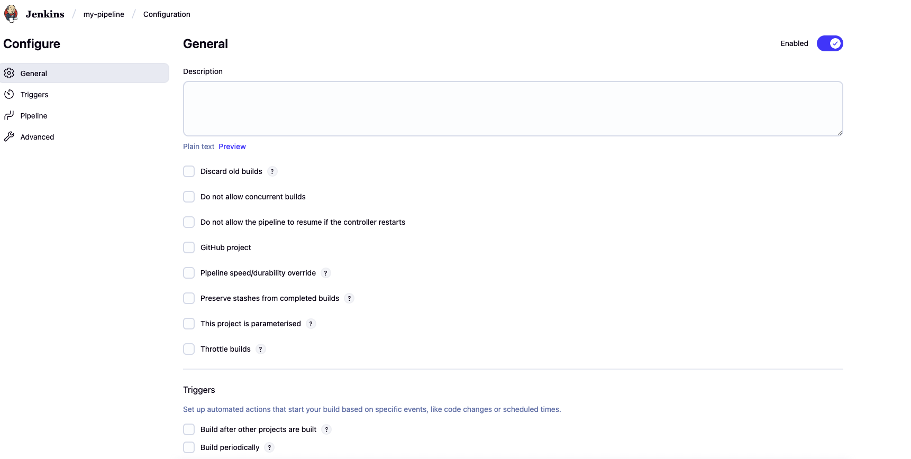
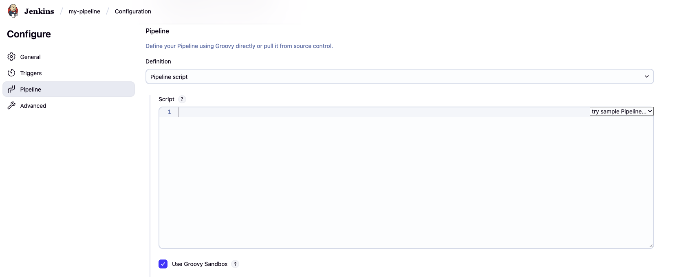
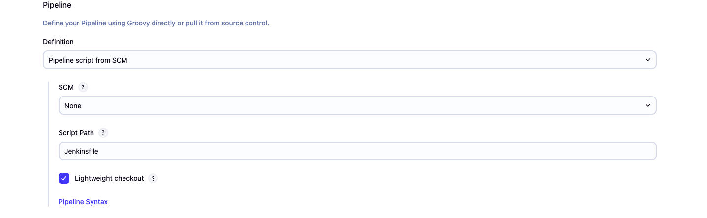
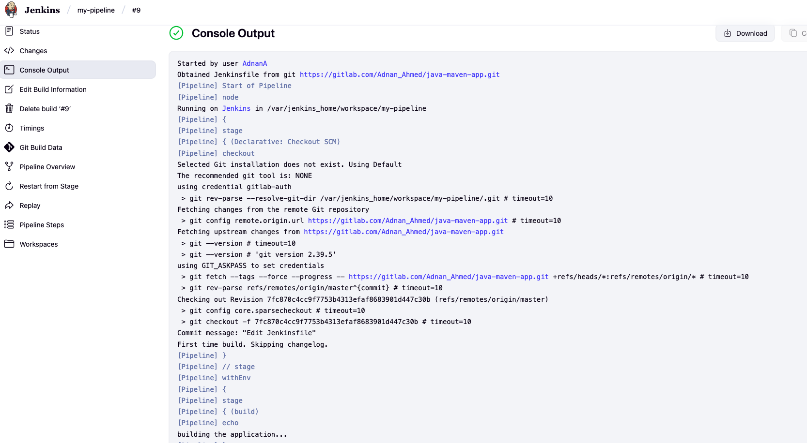

# Jenkins Pipeline — From Job Creation to Jenkinsfile

Hands-on demo of creating a **Jenkins Pipeline** job connected to a Git repository (GitLab in this example), using a `Jenkinsfile` to define **build → test → deploy** stages.

> Why pipeline jobs? They are **pipeline-as-code**, support **parallelism**, **variables**, **conditions**, and live in source control — perfect for CI/CD. Freestyle jobs are OK for quick, simple runs but limited to UI fields.

---

## 📁 Repo Structure

```
week-03-ci-cd-jenkins/
├── README.md
└── images/
    ├── step-01.png
    ├── step-02.png
    ├── step-03.png
    ├── step-04.png
    ├── step-05.png
    ├── step-06.png
    └── step-07.png
```

---

## ✅ Step-by-step

### 1) Create a **Pipeline** job


### 2) General configuration
Turn on relevant options (discard old builds, parameters, etc.) as needed.


### 3) Define the pipeline script (option A: inline)
You can write Groovy directly in Jenkins. The **Groovy Sandbox** restricts unapproved methods for safety.


### 4) (Recommended) Define from SCM
Use **Pipeline script from SCM** and point to your repo where `Jenkinsfile` lives.


### 5) Create a `Jenkinsfile` in your repo
Example **Declarative** pipeline:
```groovy
pipeline {
    agent any
    stages {
        stage('build') {
            steps {
                echo 'Building the application...'
            }
        }
        stage('test') {
            steps {
                echo 'Running tests...'
            }
        }
        stage('deploy') {
            steps {
                echo 'Deploying application...'
            }
        }
    }
}
```


### 6) Run the build — view **Stage View**
Each stage shows duration, status and logs — ideal for troubleshooting.


### 7) Inspect **Console Output**
Full logs for checkout + each stage are available.


---

## 🧠 Notes

- **Freestyle vs Pipeline**: Freestyle is UI-driven and limited; **Pipeline** is code-driven and versioned.
- **Groovy**: a Java-like language; Declarative syntax is simpler, Scripted is more flexible.
- **Best practice**: keep the pipeline in Git (Infrastructure as Code).

---

## 🔜 Next

Deep-dive into Declarative syntax: stages, steps, environment, tools, matrix, `when` conditions, `post` actions, and **parallel** stages; then integrate Docker, AWS and Kubernetes.

---

*Generated on 2025-10-13*
